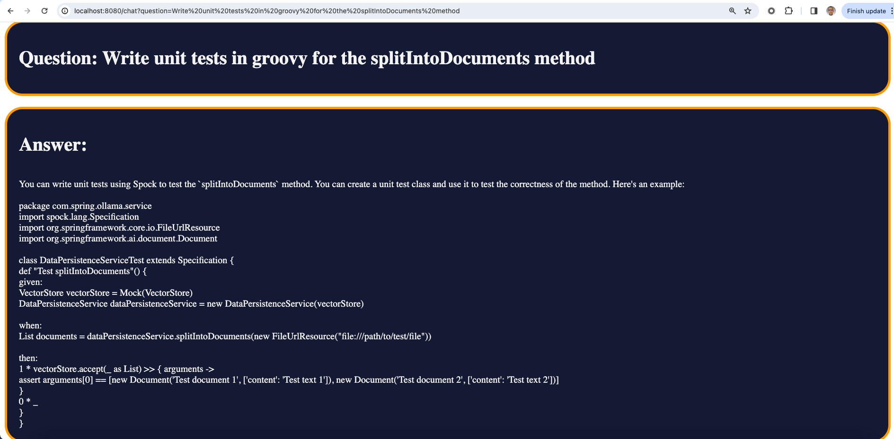
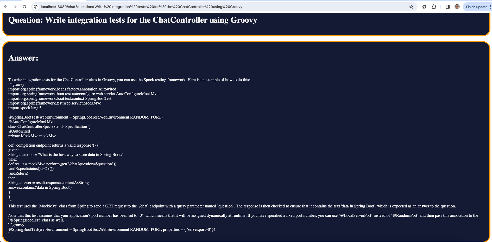

# Simple RAG with Spring AI, Ollama and Docker

Simple RAG (Retrieval-Augmented-Generation) implementation, using Spring AI, Ollama (with codellama),
PG vector store and Docker. Everything is running locally (depending on your hardware).

In this example, it s a self-aware app, which, when used to ask codellama a question, it will have its own
source code stuffed in the prompted with the user query.

## Prerequisites
* SDKMan installed
* Docker runtime

## Run the project and have fun

Clone the project repo and cd into the project folder.

Start terminal:
```bash
sdk env 
```

and also

```bash
gradle wrapper
```

To spin up the containers (Postgres vector db and ollama) in detached mode from the docker-compose.yaml, run:

```bash
docker-compose up -d
```

Now you must have the postgres vector instance and the Ollama manager up and running locally

To start the codellama LLM, run:
```bash
docker exec -it ollama ollama run codellama
```

It may take a while until the LLM is downloaded and started locally.
Once done, use'/bye' to quit the chat session with codellama.

Next, let's start the spring boot app, by:
```bash
gradle bootRun -i
```

Once the web app is running, you can call the /data/load endpoint, to embed all the app code 
into the pg vector store.

```bash
curl -X POST http://localhost:8080/data/load
```

This endpoint will turn each class from this repository into a known (to codellama) embedding model 
and persist it into the pg vector store. This process may take some time, depending on your hardware.

The Spring app logs will output detailed logs about which file is being vectorised. Once, all embeddings
are saved, you can start asking questions to the self-aware app.

Tests were not added intentionally. You can actually play with codellama and ask it to write the tests
for you. Like, for example:



or




